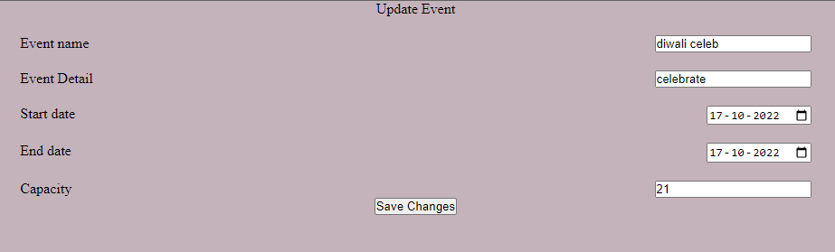

### About App 
 This is simple nodejs project 
 The main purpose of this project is  to organize the an Event based on our requirement

### I have learnt

1: How to start a nodejs project
2: How to create routes for your server application
3: How to send request to the server

4:  In this project I have learnt how fetch data from the server 
5: And also learn Dom event 

### Installation
Get a clone of application from [Here](git@github.com:sachinrao-dev/EventOrganizeee.git)

- Start the server
### `node app.js`

Runs the app in the development mode. Open [http://localhost:3000](http://localhost:3000) to view it in your browser.
The page will reload when you make changes. You may also see any lint errors in the console.

## Initial View of Application

## filled token and after clicked the submit button 

## after clicked particular event

## after clicked Update button

## after clicked Add event button
